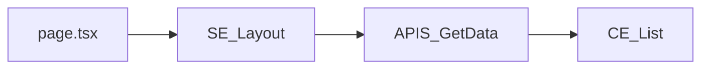

# 03 — Astro Starlight: Konten

**Status:** ✅ Selesai
**Tujuan:** Menulis seluruh konten dokumentasi dalam MDX — migrasi v1 + konten baru v2.
Bergantung pada: Step 01 (spec selesai) + Step 02 (Astro sudah running).

---

## Checklist

### Migrasi dari v1
- [x] Introduction
- [x] Structure: Root, Feature, Action, Element, Function, API, Library, Registry, Language

### Naming Conventions (tulis ulang, lebih terstruktur)
- [x] Overview — kenapa naming convention penting
- [x] Folder naming
- [x] File naming — semua tipe dengan tabel lengkap
- [x] Symbol naming — semua prefix dengan tabel + contoh kode

### Pattern Guide (konten baru)
- [x] Overview
- [x] Pattern A — Server Fetch
- [x] Pattern B — Client Fetch (TanStack Query)
- [x] Pattern C — Form Submit (TanStack Form + Zod + Server Action)
- [x] Pattern D — URL Search Params
- [x] Pattern E — Zustand
- [x] Pattern F — shadcn/ui Extension
- [x] Pattern G — Library Adapter
- [x] Pattern H — i18n dengan next-intl

### Stack Guide (konten baru)
- [x] shadcn/ui — cara setup dan cara extend
- [x] Zustand — setup, feature store vs global store
- [x] TanStack Query — setup QueryClient, pola penggunaan bersama Server Component
- [x] TanStack Form — integrasi dengan Zod dan Server Action
- [x] Zod — pola penulisan schema, ZS_ prefix
- [x] next-intl — setup, namespace per feature, server vs client usage

### AI Workflow (konten baru)
- [ ] Halaman "Skills & Commands" — daftar skills + commands tersedia
- [ ] Instruksi install via skills.sh
- [ ] Instruksi install via GitHub (fallback)
- [ ] CTA download di homepage

### Lainnya
- [x] Contributing guide
- [ ] Changelog v1 → v2

---

## Inventaris Konten v1 yang Akan Dimigrasikan

| File lama | Halaman baru | Catatan |
|-----------|-------------|---------|
| `pages/index.md` | `docs/index.mdx` | Tulis ulang, lebih ringkas |
| `pages/folder/main.md` | `structure/root.mdx` | |
| `pages/folder/feature.md` | `structure/feature.mdx` | |
| `pages/folder/action.md` | `structure/action.mdx` | |
| `pages/folder/element.md` | `structure/element.mdx` | |
| `pages/folder/function.md` | `structure/function.mdx` | |
| `pages/folder/api.md` | `structure/api.mdx` | |
| `pages/folder/lib.md` | `structure/lib.mdx` | |
| `pages/folder/registry.md` | `structure/registry.mdx` | |
| `pages/folder/lang.md` | `structure/lib-adapter.mdx` | Tulis ulang sebagai Pattern G |
| `pages/naming/file/*.md` | `naming/file.mdx` | Gabung jadi satu halaman |
| `pages/naming/folder/*.md` | `naming/folder.mdx` | Gabung jadi satu halaman |
| `pages/naming/function/*.md` | `naming/symbol.mdx` | Gabung + tambah prefix baru |
| `pages/workflow/*.md` | `patterns/*.mdx` | Tulis ulang sepenuhnya |

**Konten yang tidak dimigrasikan:**
- `pages/workflow/fetching.server.md` — hanya berisi gambar, diganti Pattern A
- `pages/workflow/fetching.client.md` — diganti Pattern B
- `pages/workflow/posting.client.md` — diganti Pattern C
- `pages/workflow/case-study/component.md` — GlobalEmitter, tidak relevan di v2

---

## Panduan Penulisan Konten

### Struktur tiap halaman MDX

```mdx
---
title: Judul Halaman
description: Satu kalimat deskripsi untuk SEO dan AI indexing
---

## Tujuan

[Satu paragraf: apa ini, kapan dipakai, kenapa ada]

## Aturan

[Tabel atau list rules yang konkret]

## Contoh

[Code block yang bisa langsung copy-paste]

## Kapan Tidak Pakai Ini

[Edge cases, anti-patterns yang perlu dihindari]
```

### Tone

- Bahasa Indonesia untuk penjelasan
- Bahasa Inggris untuk kode, nama simbol, nama file
- Hindari paragraf panjang — gunakan tabel dan list
- Setiap halaman harus bisa dibaca dalam 2 menit

### Code blocks

Selalu sertakan path file sebagai komentar pertama:

```tsx
// app/login/$element/client.form.tsx
"use client"
// ...
```

---

## Catatan Pengembangan Lanjutan

### Menambah halaman baru (misal: i18n dengan next-intl)

1. Buat file `apps/docs/src/content/docs/stack/next-intl.mdx`
2. Tambahkan entry di sidebar `astro.config.mjs` di bawah section "Stack Guide"
3. Ikuti struktur halaman MDX di atas
4. Jika ada perubahan folder/naming convention, update juga `01-convention-spec.md`

### Menambah diagram interaktif

Opsi yang tersedia di Astro MDX:
- **Mermaid** via plugin `rehype-mermaid` — diagram flow text-based, mudah di-maintain
- **Excalidraw embed** — untuk diagram yang lebih visual
- **Custom React component** — untuk diagram interaktif

Untuk diagram alur data (seperti gambar di v1), Mermaid adalah pilihan terbaik
karena bisa di-version control dan mudah di-edit tanpa software khusus:

```mdx

```
