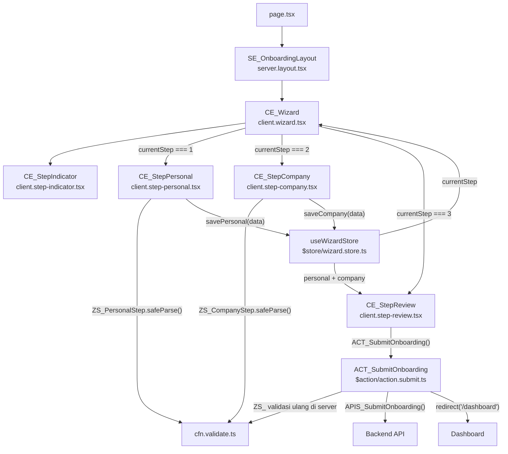

## Gambaran Umum

Form onboarding multi-step dengan 3 langkah: data personal, data perusahaan,
dan review sebelum submit. State setiap step disimpan di Zustand — user bisa
kembali ke step sebelumnya tanpa kehilangan data yang sudah diisi.

Submit final terjadi di step terakhir via Server Action dengan validasi Zod
yang dijalankan ulang di server.

---

## Pattern yang Digunakan

| Pattern | Peran dalam Fitur Ini |
|---------|----------------------|
| [Pattern C — Form Submit](/patterns/form-submit) | Setiap step punya `ZS_` sendiri; submit final via `ACT_SubmitOnboarding` |
| [Pattern E — Zustand](/patterns/zustand) | `useWizardStore` menyimpan `currentStep` + data tiap step |
| [Pattern F — shadcn/ui Extension](/patterns/shadcn) | `CE_StepIndicator` extend shadcn `Progress` dengan label step |
| [Pattern H — i18n](/patterns/i18n) | Label step, tombol navigasi, pesan validasi |

---

## Struktur File

```
app/onboarding/
├── page.tsx                           entry point
├── $action/
│   └── action.submit.ts               ACT_SubmitOnboarding
├── $element/
│   ├── server.layout.tsx              SE_OnboardingLayout
│   ├── client.wizard.tsx              CE_Wizard (orchestrator)
│   ├── client.step-personal.tsx       CE_StepPersonal (step 1)
│   ├── client.step-company.tsx        CE_StepCompany (step 2)
│   ├── client.step-review.tsx         CE_StepReview (step 3 + submit)
│   └── client.step-indicator.tsx      CE_StepIndicator
├── $function/
│   └── cfn.validate.ts                CFN_ValidateStep + ZS_ schemas
└── $store/
    └── wizard.store.ts                useWizardStore

messages/
├── en.json                            namespace "Onboarding"
└── id.json
```

---

## Pattern E — Zustand

> `useWizardStore` menjadi sumber kebenaran tunggal untuk seluruh wizard:
> langkah aktif, data yang sudah diisi, dan fungsi transisi antar step.

```ts
// app/onboarding/$store/wizard.store.ts

import { create } from "zustand"

interface I_PersonalData {
//         ↑ I_ prefix — TypeScript interface
    fullName: string
    email: string
    phone: string
}

interface I_CompanyData {
    companyName: string
    industry: string
    size: string
}

interface I_WizardStore {
    currentStep: number
    personal: Partial<I_PersonalData>
    company: Partial<I_CompanyData>
    setStep: (step: number) => void
    savePersonal: (data: I_PersonalData) => void
    saveCompany: (data: I_CompanyData) => void
    reset: () => void
}

export const useWizardStore = create<I_WizardStore>((set) => ({
//             ↑ useXxxStore pattern — Zustand hook

    currentStep: 1,
    personal: {},
    company: {},
    setStep: (step) => set({ currentStep: step }),
    savePersonal: (data) => set({ personal: data, currentStep: 2 }),
//  savePersonal menyimpan data DAN pindah ke step berikutnya dalam satu aksi
    saveCompany: (data) => set({ company: data, currentStep: 3 }),
    reset: () => set({ currentStep: 1, personal: {}, company: {} }),
}))
```

```tsx
// app/onboarding/$element/client.wizard.tsx
"use client"

import { useWizardStore } from "../$store/wizard.store"
import { CE_StepPersonal } from "./client.step-personal"
import { CE_StepCompany } from "./client.step-company"
import { CE_StepReview } from "./client.step-review"
import { CE_StepIndicator } from "./client.step-indicator"

export function CE_Wizard() {
//              ↑ CE_ prefix — orchestrator, hanya routing antar step

    const { currentStep } = useWizardStore()

    return (
        <div>
            <CE_StepIndicator current={currentStep} total={3} />
            {currentStep === 1 && <CE_StepPersonal />}
            {currentStep === 2 && <CE_StepCompany />}
            {currentStep === 3 && <CE_StepReview />}
        </div>
    )
}
```

---

## Pattern C — Form Submit (per step + final)

> Setiap step memiliki Zod schema sendiri (`ZS_`). Validasi dijalankan di client
> sebelum pindah ke step berikutnya, lalu divalidasi ulang di Server Action.

```ts
// app/onboarding/$function/cfn.validate.ts
// CFN_ prefix — Client Function, definisi ZS_ schema per step

import { z } from "zod"

export const ZS_PersonalStep = z.object({
//             ↑ ZS_ prefix — Zod schema
    fullName: z.string().min(2, "Nama minimal 2 karakter"),
    email: z.string().email("Format email tidak valid"),
    phone: z.string().min(10, "Nomor telepon minimal 10 digit"),
})

export const ZS_CompanyStep = z.object({
    companyName: z.string().min(2, "Nama perusahaan minimal 2 karakter"),
    industry: z.string().min(1, "Pilih industri"),
    size: z.string().min(1, "Pilih ukuran perusahaan"),
})

export type T_PersonalStep = z.infer<typeof ZS_PersonalStep>
//           ↑ T_ prefix — Type alias dari Zod inference
export type T_CompanyStep = z.infer<typeof ZS_CompanyStep>
```

```tsx
// app/onboarding/$element/client.step-personal.tsx
"use client"

import { useForm } from "@tanstack/react-form"
import { ZS_PersonalStep } from "../$function/cfn.validate"
import { useWizardStore } from "../$store/wizard.store"
import { useTranslations } from "next-intl"

export function CE_StepPersonal() {
//              ↑ CE_ prefix

    const t = useTranslations("Onboarding")
    const { savePersonal, personal } = useWizardStore()
//                          ↑ Pattern E — baca data tersimpan untuk pre-fill

    const form = useForm({
        defaultValues: {
            fullName: personal.fullName ?? "",
            email: personal.email ?? "",
            phone: personal.phone ?? "",
        },
        onSubmit: async ({ value }) => {
            const parsed = ZS_PersonalStep.safeParse(value)
//                          ↑ ZS_ — validasi sebelum pindah step

            if (!parsed.success) return
            savePersonal(parsed.data)
//          ↑ simpan ke store + currentStep otomatis jadi 2
        },
    })

    return (
        <form onSubmit={(e) => { e.preventDefault(); form.handleSubmit() }}>
            <form.Field name="fullName">
                {(field) => (
                    <input
                        value={field.state.value}
                        onChange={(e) => field.handleChange(e.target.value)}
                        placeholder={t("step1.fullNamePlaceholder")}
                    />
                )}
            </form.Field>
            <button type="submit">{t("next")}</button>
        </form>
    )
}
```

```ts
// app/onboarding/$action/action.submit.ts
"use server"

import { redirect } from "next/navigation"
import { ZS_PersonalStep, ZS_CompanyStep } from "../$function/cfn.validate"
import { APIS_SubmitOnboarding } from "@/api/onboarding/submit"

export async function ACT_SubmitOnboarding(payload: {
//                    ↑ ACT_ prefix — Server Action, wajib "use server"
    personal: unknown
    company: unknown
}) {
    const personal = ZS_PersonalStep.safeParse(payload.personal)
    const company = ZS_CompanyStep.safeParse(payload.company)
//  Validasi ulang di server — tidak hanya mengandalkan validasi client

    if (!personal.success || !company.success) {
        return { error: "Data tidak valid" }
    }

    await APIS_SubmitOnboarding({ ...personal.data, ...company.data })
//         ↑ APIS_ prefix — fungsi fetch ke backend

    redirect("/dashboard")
}
```

---

## Pattern F — shadcn/ui Extension

> `CE_StepIndicator` membungkus shadcn `Progress` dengan menambahkan label
> dan penanda step aktif — tanpa menyentuh file di `components/ui/`.

```tsx
// app/onboarding/$element/client.step-indicator.tsx
"use client"

import { Progress } from "@/components/ui/progress"
//                    ↑ shadcn/ui — jangan dimodifikasi langsung
import { cn } from "@/lib/utils"
import { useTranslations } from "next-intl"

interface I_StepIndicatorProps {
//         ↑ I_ prefix
    current: number
    total: number
}

export function CE_StepIndicator({ current, total }: I_StepIndicatorProps) {
//              ↑ CE_ prefix — wrapper atas shadcn Progress

    const t = useTranslations("Onboarding")
    const stepLabels = [t("step1.label"), t("step2.label"), t("step3.label")]
    const percentage = (current / total) * 100

    return (
        <div>
            <Progress value={percentage} className="mb-2" />
            <div className="flex justify-between text-sm text-muted-foreground">
                {stepLabels.map((label, i) => (
                    <span
                        key={label}
                        className={cn(i + 1 <= current && "text-primary font-medium")}
                    >
                        {label}
                    </span>
                ))}
            </div>
        </div>
    )
}
```

---

## Pattern H — i18n

> Semua teks wizard dikelola di namespace `"Onboarding"` — label step,
> tombol navigasi, dan placeholder field.

```json
// messages/id.json (sebagian)
{
  "Onboarding": {
    "step1": {
      "label": "Data Personal",
      "fullNamePlaceholder": "Nama lengkap",
      "emailPlaceholder": "Alamat email",
      "phonePlaceholder": "Nomor telepon"
    },
    "step2": {
      "label": "Data Perusahaan",
      "companyNamePlaceholder": "Nama perusahaan"
    },
    "step3": { "label": "Review & Submit" },
    "next": "Lanjut",
    "back": "Kembali",
    "submit": "Kirim"
  }
}
```

---

## Alur Lengkap



---

## Convention yang Diterapkan

| Simbol / File | Convention | Aturan |
|---------------|------------|--------|
| `SE_OnboardingLayout` | `SE_` prefix | Server Component |
| `CE_Wizard`, `CE_StepPersonal`, `CE_StepIndicator` | `CE_` prefix | Client Component — `"use client"` |
| `CE_StepIndicator` | `CE_` prefix | Wrapper atas shadcn `Progress` |
| `ACT_SubmitOnboarding` | `ACT_` prefix | Server Action — validasi Zod dijalankan ulang |
| `ZS_PersonalStep`, `ZS_CompanyStep` | `ZS_` prefix | Zod schema per step |
| `T_PersonalStep`, `T_CompanyStep` | `T_` prefix | Type alias dari `z.infer<>` |
| `useWizardStore` | `useXxxStore` pattern | Zustand store scoped ke feature |
| `I_WizardStore`, `I_PersonalData` | `I_` prefix | TypeScript interface |
| `APIS_SubmitOnboarding` | `APIS_` prefix | Fungsi fetch ke backend |
| `action.submit.ts` | `action.[sub].ts` | File naming Server Action |
| `client.step-personal.tsx` | `client.[module].tsx` | File naming Client Element |
| `wizard.store.ts` | `[module].store.ts` | File naming Zustand Store |
| `cfn.validate.ts` | `cfn.[module].ts` | File naming Client Function |
