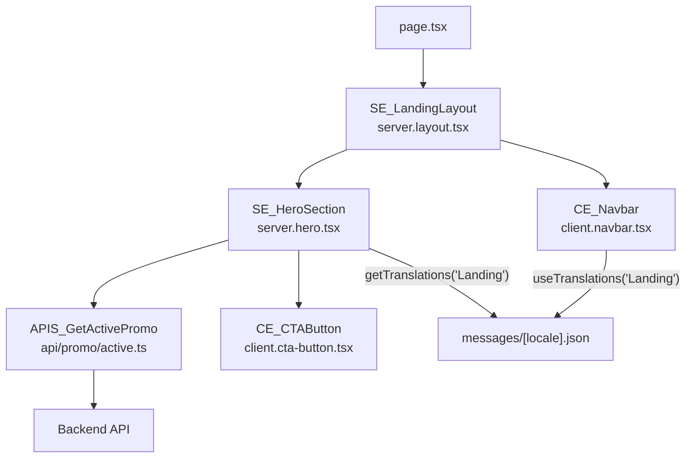

## Gambaran Umum

Halaman landing page yang mendukung dua bahasa (Indonesia dan Inggris). Data promo
di-fetch di server saat render awal — tidak ada loading state yang terlihat user.
Teks diterjemahkan menggunakan next-intl dengan namespace per feature.

Fitur ini mewakili use case **halaman publik sederhana** — tanpa autentikasi,
tanpa form, tanpa state client yang kompleks.

---

## Pattern yang Digunakan

| Pattern | Peran dalam Fitur Ini |
|---------|----------------------|
| [Pattern A — Server Fetch](/patterns/server-fetch) | `SE_HeroSection` fetch data promo dari server saat render |
| [Pattern F — shadcn/ui Extension](/patterns/shadcn) | `CE_CTAButton` extend shadcn `Button` dengan style khusus |
| [Pattern H — i18n](/patterns/i18n) | `getTranslations` di SE_, `useTranslations` + language switcher di CE_ |

---

## Struktur File

```
app/[locale]/
├── layout.tsx                     NextIntlClientProvider
├── page.tsx                       entry point → SE_LandingLayout
└── $element/
    ├── server.layout.tsx          SE_LandingLayout
    ├── server.hero.tsx            SE_HeroSection
    ├── client.navbar.tsx          CE_Navbar
    └── client.cta-button.tsx      CE_CTAButton

api/promo/
├── active.ts                      APIS_GetActivePromo
└── active.type.ts                 IRs_ActivePromo

messages/
├── en.json                        namespace "Landing"
└── id.json
```

---

## Pattern A — Server Fetch

> `SE_HeroSection` mengambil data promo saat server render — user langsung melihat
> konten tanpa loading state.

```tsx
// app/[locale]/page.tsx
// page.tsx hanya boleh return satu SE_ component — tidak ada logika di sini

import { SE_LandingLayout } from "./$element/server.layout"

export default function Page() {
    return <SE_LandingLayout />
//          ↑ SE_ prefix — selalu Server Component sebagai root render
}
```

```tsx
// app/[locale]/$element/server.hero.tsx

import { getTranslations } from "next-intl/server"
import { APIS_GetActivePromo } from "@/api/promo/active"
import { CE_CTAButton } from "./client.cta-button"

export async function SE_HeroSection() {
//                    ↑ SE_ prefix — Server Component, boleh async

    const promo = await APIS_GetActivePromo()
//                      ↑ APIS_ prefix — fungsi fetch ke backend

    const t = await getTranslations("Landing")

    return (
        <section>
            <h1>{t("hero.title")}</h1>
            <p>{promo.tagline}</p>
            <CE_CTAButton href={promo.ctaUrl}>
                {t("hero.cta")}
            </CE_CTAButton>
        </section>
    )
}
```

```ts
// api/promo/active.ts

import type { IRs_ActivePromo } from "./active.type"
//             ↑ IRs_ prefix — interface Response dari API

export async function APIS_GetActivePromo(): Promise<IRs_ActivePromo> {
//                    ↑ APIS_ prefix — API Server call

    const res = await fetch(`${process.env.API_URL}/promo/active`, {
        next: { revalidate: 3600 },
    })
    if (!res.ok) throw new Error("Failed to fetch promo")
    return res.json()
}
```

---

## Pattern H — i18n (next-intl)

> Teks diterjemahkan per namespace — SE_ pakai `getTranslations`, CE_ pakai
> `useTranslations`. Language switcher menggunakan `useRouter` dari next-intl.

```json
// messages/id.json
{
  "Landing": {
    "nav": { "features": "Fitur", "pricing": "Harga" },
    "hero": {
      "title": "Bangun lebih cepat dengan convention yang jelas",
      "cta": "Mulai Sekarang"
    }
  }
}
```

```json
// messages/en.json
{
  "Landing": {
    "nav": { "features": "Features", "pricing": "Pricing" },
    "hero": {
      "title": "Build faster with clear conventions",
      "cta": "Get Started"
    }
  }
}
```

```tsx
// app/[locale]/$element/client.navbar.tsx
"use client"

import { useTranslations, useLocale } from "next-intl"
import { useRouter, usePathname } from "next-intl/navigation"

export function CE_Navbar() {
//              ↑ CE_ prefix — Client Component ("use client" wajib)

    const t = useTranslations("Landing")
//             ↑ useTranslations (bukan getTranslations) — hanya untuk CE_

    const locale = useLocale()
    const router = useRouter()
    const pathname = usePathname()

    function handleLocaleChange(next: string) {
        router.replace(pathname, { locale: next })
    }

    return (
        <nav>
            <a href="#">{t("nav.features")}</a>
            <a href="#">{t("nav.pricing")}</a>
            <button onClick={() => handleLocaleChange(locale === "id" ? "en" : "id")}>
                {locale === "id" ? "EN" : "ID"}
            </button>
        </nav>
    )
}
```

---

## Pattern F — shadcn/ui Extension

> `CE_CTAButton` membungkus shadcn `Button` tanpa memodifikasi file di `components/ui/`.
> Semua kustomisasi ada di wrapper ini.

```tsx
// app/[locale]/$element/client.cta-button.tsx
"use client"

import { Button } from "@/components/ui/button"
//                    ↑ shadcn/ui — jangan dimodifikasi langsung
import { cn } from "@/lib/utils"

interface I_CTAButtonProps {
//         ↑ I_ prefix — TypeScript interface
    href: string
    children: React.ReactNode
    className?: string
}

export function CE_CTAButton({ href, children, className }: I_CTAButtonProps) {
//              ↑ CE_ prefix — Client Component

    return (
        <Button
            asChild
            className={cn("rounded-full px-8 py-6 text-lg font-semibold", className)}
        >
            <a href={href}>{children}</a>
        </Button>
    )
}
```

---

## Alur Lengkap



---

## Convention yang Diterapkan

| Simbol / File | Convention | Aturan |
|---------------|------------|--------|
| `SE_LandingLayout`, `SE_HeroSection` | `SE_` prefix | Server Component — boleh `async`, boleh fetch |
| `CE_Navbar`, `CE_CTAButton` | `CE_` prefix | Client Component — wajib `"use client"` |
| `APIS_GetActivePromo` | `APIS_` prefix | Fungsi fetch ke backend, ada di `api/` |
| `IRs_ActivePromo` | `IRs_` prefix | Interface Response dari API |
| `I_CTAButtonProps` | `I_` prefix | TypeScript interface props komponen |
| `server.layout.tsx` | `server.[module].tsx` | File naming Server Element |
| `client.navbar.tsx` | `client.[module].tsx` | File naming Client Element |
| `active.type.ts` | `[resource].type.ts` | File naming API Types |
| `page.tsx` | Hanya return `SE_` | Tidak ada logika apapun di sini |
