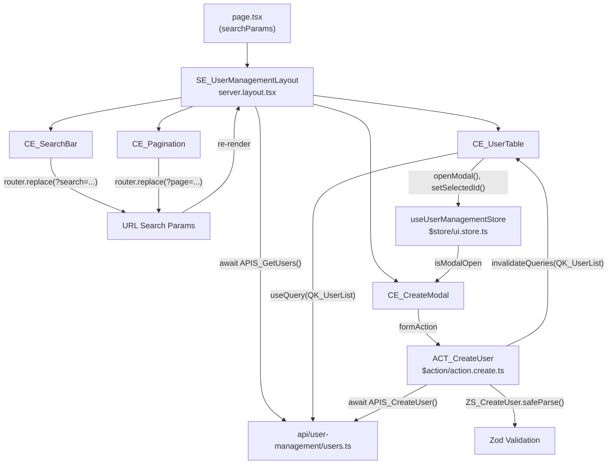

## Gambaran Umum

Halaman internal untuk mengelola daftar user: search, pagination, tambah user via modal,
dan hapus user. Ini adalah use case paling umum di aplikasi internal — dan kombinasi
paling lengkap dari convention yang tersedia.

Initial data di-fetch di server. Setelah mutasi (tambah/hapus), TanStack Query
me-refetch data tanpa navigasi. Search dan pagination hidup di URL agar bisa di-share
dan di-bookmark. State modal (buka/tutup) disimpan di Zustand.

---

## Pattern yang Digunakan

| Pattern | Peran dalam Fitur Ini |
|---------|----------------------|
| [Pattern A — Server Fetch](/patterns/server-fetch) | `SE_UserManagementLayout` fetch initial list saat render |
| [Pattern B — Client Fetch](/patterns/client-fetch) | `CE_UserTable` refetch otomatis setelah create/delete |
| [Pattern C — Form Submit](/patterns/form-submit) | `CE_CreateModal` — TanStack Form + `ZS_CreateUser` + `ACT_CreateUser` |
| [Pattern D — URL Search Params](/patterns/url-params) | `CE_SearchBar` + `CE_Pagination` — search dan page di URL |
| [Pattern E — Zustand](/patterns/zustand) | `useUserManagementStore` — state modal dan selected user |
| [Pattern H — i18n](/patterns/i18n) | Label tabel, placeholder, pesan error via namespace `"UserManagement"` |

---

## Struktur File

```
app/user-management/
├── page.tsx                         entry point
├── $action/
│   ├── action.create.ts             ACT_CreateUser
│   └── action.delete.ts             ACT_DeleteUser
├── $element/
│   ├── server.layout.tsx            SE_UserManagementLayout
│   ├── client.searchbar.tsx         CE_SearchBar
│   ├── client.table.tsx             CE_UserTable
│   ├── client.create-modal.tsx      CE_CreateModal
│   └── client.pagination.tsx        CE_Pagination
└── $store/
    └── ui.store.ts                  useUserManagementStore

api/user-management/
├── users.ts                         APIS_GetUsers, APIS_CreateUser
└── users.type.ts                    IRq_CreateUser, IRq_GetUsers, IRs_UserList

reg/
└── query-keys.register.ts           QK_UserList

messages/
├── en.json                          namespace "UserManagement"
└── id.json
```

---

## Pattern A — Server Fetch

> `SE_UserManagementLayout` mem-fetch list user dari server menggunakan `searchParams`
> dari URL — render awal sudah berisi data tanpa loading state.

```tsx
// app/user-management/page.tsx
// Hanya meneruskan searchParams ke SE_ — tidak ada logika

import { SE_UserManagementLayout } from "./$element/server.layout"

export default async function Page({
    searchParams,
}: {
    searchParams: Promise<{ search?: string; page?: string }>
}) {
    const params = await searchParams
    return <SE_UserManagementLayout searchParams={params} />
}
```

```tsx
// app/user-management/$element/server.layout.tsx

import { getTranslations } from "next-intl/server"
import { APIS_GetUsers } from "@/api/user-management/users"
import { CE_SearchBar } from "./client.searchbar"
import { CE_UserTable } from "./client.table"
import { CE_Pagination } from "./client.pagination"
import { CE_CreateModal } from "./client.create-modal"

interface I_Props {
    searchParams: { search?: string; page?: string }
}

export async function SE_UserManagementLayout({ searchParams }: I_Props) {
//                    ↑ SE_ prefix — Server Component, async

    const t = await getTranslations("UserManagement")

    const data = await APIS_GetUsers({
//                      ↑ APIS_ prefix — fungsi fetch ke backend
        search: searchParams.search,
        page: Number(searchParams.page) || 1,
    })

    return (
        <section>
            <h1>{t("title")}</h1>
            <CE_SearchBar />
            <CE_UserTable initialData={data} />
            <CE_Pagination total={data.total} />
            <CE_CreateModal />
        </section>
    )
}
```

---

## Pattern B — Client Fetch (TanStack Query)

> `CE_UserTable` menggunakan `useQuery` dengan `QK_UserList` agar data otomatis
> ter-refetch setelah mutasi tanpa perlu navigasi.

```ts
// reg/query-keys.register.ts

export const QK_UserList = (params: { search?: string; page?: number }) =>
//             ↑ QK_ prefix — TanStack Query key constant di reg/
    ["user-management", "list", params] as const
```

```tsx
// app/user-management/$element/client.table.tsx
"use client"

import { useQuery } from "@tanstack/react-query"
import { useSearchParams } from "next/navigation"
import { QK_UserList } from "@/reg/query-keys.register"
import { APIS_GetUsers } from "@/api/user-management/users"
import { useUserManagementStore } from "../$store/ui.store"
import type { IRs_UserList } from "@/api/user-management/users.type"

interface I_Props {
//         ↑ I_ prefix — interface props
    initialData: IRs_UserList
}

export function CE_UserTable({ initialData }: I_Props) {
//              ↑ CE_ prefix — Client Component

    const searchParams = useSearchParams()
    const search = searchParams.get("search") ?? ""
    const page = Number(searchParams.get("page")) || 1

    const { data } = useQuery({
        queryKey: QK_UserList({ search, page }),
//                ↑ QK_ — key yang sama dipakai di invalidateQueries setelah mutasi
        queryFn: () => APIS_GetUsers({ search, page }),
        initialData,
//      ↑ data dari server dipakai sebagai initial — tidak ada loading flicker
    })

    const { setSelectedId, openModal } = useUserManagementStore()
//                                        ↑ Pattern E — Zustand store

    return (
        <table>
            <tbody>
                {data.items.map((user) => (
                    <tr key={user.id}>
                        <td>{user.name}</td>
                        <td>{user.email}</td>
                        <td>
                            <button
                                onClick={() => {
                                    setSelectedId(user.id)
                                    openModal()
                                }}
                            >
                                Edit
                            </button>
                        </td>
                    </tr>
                ))}
            </tbody>
        </table>
    )
}
```

---

## Pattern C — Form Submit

> `ACT_CreateUser` mem-validasi payload dengan `ZS_CreateUser` sebelum memanggil
> `APIS_CreateUser`. Setelah berhasil, query di-invalidate agar `CE_UserTable` refetch.

```ts
// app/user-management/$action/action.create.ts
"use server"

import { revalidateTag } from "next/cache"
import { z } from "zod"
import { APIS_CreateUser } from "@/api/user-management/users"

const ZS_CreateUser = z.object({
//     ↑ ZS_ prefix — Zod schema, validasi wajib sebelum APIS_
    name: z.string().min(2),
    email: z.string().email(),
    role: z.string().min(1),
})

export async function ACT_CreateUser(_: unknown, formData: FormData) {
//                    ↑ ACT_ prefix — Server Action, wajib "use server"

    const raw = {
        name: formData.get("name"),
        email: formData.get("email"),
        role: formData.get("role"),
    }

    const parsed = ZS_CreateUser.safeParse(raw)
    if (!parsed.success) {
        return { error: parsed.error.flatten().fieldErrors }
    }

    const result = await APIS_CreateUser(parsed.data)
    if (!result.ok) return { error: { _root: [result.message] } }

    revalidateTag("users")
    return { success: true }
}
```

```tsx
// app/user-management/$element/client.create-modal.tsx
"use client"

import { useActionState } from "react"
import { useQueryClient } from "@tanstack/react-query"
import { ACT_CreateUser } from "../$action/action.create"
import { useUserManagementStore } from "../$store/ui.store"
//                                    ↑ Pattern E — baca isModalOpen dari store
import { useTranslations } from "next-intl"

export function CE_CreateModal() {
//              ↑ CE_ prefix

    const t = useTranslations("UserManagement")
    const { isModalOpen, closeModal } = useUserManagementStore()
    const queryClient = useQueryClient()

    const [state, formAction, isPending] = useActionState(ACT_CreateUser, null)

    async function handleSuccess() {
        await queryClient.invalidateQueries({ queryKey: ["user-management", "list"] })
//      ↑ invalidate QK_UserList → CE_UserTable refetch otomatis (Pattern B)
        closeModal()
    }

    if (!isModalOpen) return null

    return (
        <dialog open>
            <form action={formAction}>
                <input name="name" placeholder={t("form.namePlaceholder")} />
                <input name="email" placeholder={t("form.emailPlaceholder")} />
                {state?.error?._root && <p>{state.error._root[0]}</p>}
                <button disabled={isPending}>{t("form.submit")}</button>
                <button type="button" onClick={closeModal}>{t("form.cancel")}</button>
            </form>
        </dialog>
    )
}
```

---

## Pattern D — URL Search Params

> Search dan pagination disimpan di URL — bisa di-bookmark dan di-share.
> `CE_SearchBar` menulis ke URL, `SE_UserManagementLayout` membaca dari `searchParams`.

```tsx
// app/user-management/$element/client.searchbar.tsx
"use client"

import { useRouter, useSearchParams } from "next/navigation"
import { useDebouncedCallback } from "use-debounce"
import { useTranslations } from "next-intl"

export function CE_SearchBar() {
//              ↑ CE_ prefix

    const t = useTranslations("UserManagement")
    const router = useRouter()
    const searchParams = useSearchParams()

    const handleSearch = useDebouncedCallback((term: string) => {
        const params = new URLSearchParams(searchParams)
        term ? params.set("search", term) : params.delete("search")
        params.set("page", "1")
//      Reset ke page 1 setiap kali search berubah
        router.replace(`?${params.toString()}`)
//      router.replace — tidak menambah history entry baru
    }, 300)

    return (
        <input
            defaultValue={searchParams.get("search") ?? ""}
            onChange={(e) => handleSearch(e.target.value)}
            placeholder={t("searchPlaceholder")}
        />
    )
}
```

---

## Pattern E — Zustand

> `useUserManagementStore` menyimpan state modal dan ID user yang dipilih.
> `CE_UserTable` men-dispatch, `CE_CreateModal` men-subscribe — tanpa prop drilling.

```ts
// app/user-management/$store/ui.store.ts
// $store/ di dalam feature — hanya dipakai oleh user-management

import { create } from "zustand"

interface I_UserManagementStore {
//         ↑ I_ prefix — TypeScript interface
    isModalOpen: boolean
    selectedId: string | null
    openModal: () => void
    closeModal: () => void
    setSelectedId: (id: string | null) => void
}

export const useUserManagementStore = create<I_UserManagementStore>((set) => ({
//             ↑ useXxxStore pattern — mengikuti React hook convention
    isModalOpen: false,
    selectedId: null,
    openModal: () => set({ isModalOpen: true }),
    closeModal: () => set({ isModalOpen: false, selectedId: null }),
    setSelectedId: (id) => set({ selectedId: id }),
}))
```

---

## Pattern H — i18n

> Semua teks yang tampil ke user diambil dari `messages/[locale].json`
> dengan namespace `"UserManagement"`.

```json
// messages/id.json (sebagian)
{
  "UserManagement": {
    "title": "Manajemen User",
    "searchPlaceholder": "Cari nama atau email...",
    "form": {
      "namePlaceholder": "Nama lengkap",
      "emailPlaceholder": "Alamat email",
      "submit": "Simpan",
      "cancel": "Batal"
    },
    "table": {
      "name": "Nama",
      "email": "Email",
      "actions": "Aksi"
    }
  }
}
```

---

## Alur Lengkap



---

## Convention yang Diterapkan

| Simbol / File | Convention | Aturan |
|---------------|------------|--------|
| `SE_UserManagementLayout` | `SE_` prefix | Server Component — async, fetch data |
| `CE_SearchBar`, `CE_UserTable`, `CE_CreateModal` | `CE_` prefix | Client Component — `"use client"` |
| `ACT_CreateUser`, `ACT_DeleteUser` | `ACT_` prefix | Server Action — `"use server"` |
| `APIS_GetUsers`, `APIS_CreateUser` | `APIS_` prefix | Fungsi fetch ke backend |
| `ZS_CreateUser` | `ZS_` prefix | Zod schema — validasi wajib sebelum `APIS_` |
| `QK_UserList` | `QK_` prefix | TanStack Query key constant di `reg/` |
| `IRq_CreateUser`, `IRs_UserList` | `IRq_` / `IRs_` prefix | Interface request/response API |
| `useUserManagementStore` | `useXxxStore` pattern | Zustand store — scoped ke feature |
| `I_UserManagementStore`, `I_Props` | `I_` prefix | TypeScript interface |
| `action.create.ts` | `action.[sub].ts` | File naming Server Action |
| `server.layout.tsx` | `server.[module].tsx` | File naming Server Element |
| `client.table.tsx` | `client.[module].tsx` | File naming Client Element |
| `ui.store.ts` | `[module].store.ts` | File naming Zustand Store |
| `users.type.ts` | `[resource].type.ts` | File naming API Types |
