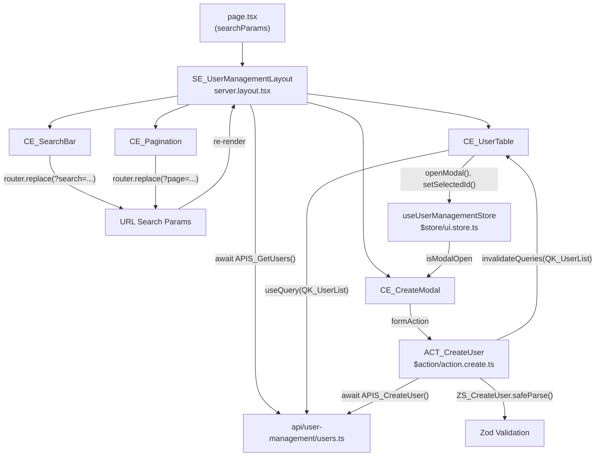

## Gambaran Umum

Halaman internal untuk mengelola daftar user: search, pagination, tambah user via modal,
dan hapus user. Ini adalah use case paling umum di aplikasi internal — dan kombinasi
paling lengkap dari convention yang tersedia.

Initial data di-fetch di server. Setelah mutasi (tambah/hapus), TanStack Query
me-refetch data tanpa navigasi. Search dan pagination hidup di URL agar bisa di-share
dan di-bookmark. State modal (buka/tutup) disimpan di Zustand.

---

## Pattern yang Digunakan

| Pattern | Peran dalam Fitur Ini |
|---------|----------------------|
| [Pattern A — Server Fetch](/patterns/server-fetch) | `SE_UserManagementLayout` fetch initial list saat render |
| [Pattern B — Client Fetch](/patterns/client-fetch) | `CE_UserTable` refetch otomatis setelah create/delete |
| [Pattern C — Form Submit](/patterns/form-submit) | `CE_CreateModal` — TanStack Form + `zodValidator` + `ACT_CreateUser` |
| [Pattern D — URL Search Params](/patterns/url-params) | `CE_SearchBar` + `CE_Pagination` — search dan page di URL via nuqs |
| [Pattern E — Zustand](/patterns/zustand) | `useUserManagementStore` — state modal dan selected user |
| [Pattern H — i18n](/patterns/i18n) | Label tabel, placeholder, pesan error via namespace `"UserManagement"` |
| [Pattern I — API Mocking (MSW)](/patterns/api-mocking) | `EP_UserManagement` sebagai path registry; `users-list.mock-handler.ts` untuk mock GET dan POST |

---

## Struktur File

```
app/user-management/
├── page.tsx                         entry point
├── $action/
│   ├── action.create.ts             ACT_CreateUser
│   └── action.delete.ts             ACT_DeleteUser
├── $element/
│   ├── server.layout.tsx            SE_UserManagementLayout
│   ├── client.searchbar.tsx         CE_SearchBar
│   ├── client.table.tsx             CE_UserTable
│   ├── client.create-modal.tsx      CE_CreateModal
│   └── client.pagination.tsx        CE_Pagination
└── $store/
    └── ui.store.ts                  useUserManagementStore

api/user-management/
├── user-management.endpoint.ts      EP_UserManagement — path constants
├── users.ts                         APIS_GetUsers, APIS_CreateUser
├── users.type.ts                    IRq_CreateUser, IRq_GetUsers, IRs_UserList
├── users-list.mock-handler.ts       mock GET /api/user-management/users
└── users-create.mock-handler.ts     mock POST /api/user-management/users

src/mocks/
├── browser.ts                       setupWorker — aktivasi di Next.js client
├── node.ts                          setupServer — aktivasi di testing
└── index.ts                         kumpulkan semua handler + initMocks()

reg/
└── query-keys.register.ts           QK_UserList

messages/
├── en.json                          namespace "UserManagement"
└── id.json
```

---

## Pattern A — Server Fetch

> `SE_UserManagementLayout` mem-fetch list user dari server menggunakan `searchParams`
> dari URL — render awal sudah berisi data tanpa loading state.

```tsx
// app/user-management/page.tsx
// Hanya meneruskan searchParams ke SE_ — tidak ada logika

import { SE_UserManagementLayout } from "./$element/server.layout"

export default async function Page({
    searchParams,
}: {
    searchParams: Promise<{ search?: string; page?: string }>
}) {
    const params = await searchParams
    return <SE_UserManagementLayout searchParams={params} />
}
```

```tsx
// app/user-management/$element/server.layout.tsx

import { getTranslations } from "next-intl/server"
import { APIS_GetUsers } from "@/api/user-management/users"
import { CE_SearchBar } from "./client.searchbar"
import { CE_UserTable } from "./client.table"
import { CE_Pagination } from "./client.pagination"
import { CE_CreateModal } from "./client.create-modal"

interface I_Props {
    searchParams: { search?: string; page?: string }
}

export async function SE_UserManagementLayout({ searchParams }: I_Props) {
//                    ↑ SE_ prefix — Server Component, async

    const t = await getTranslations("UserManagement")

    const data = await APIS_GetUsers({
//                      ↑ APIS_ prefix — fungsi fetch ke backend
        search: searchParams.search,
        page: Number(searchParams.page) || 1,
    })

    return (
        <section>
            <h1>{t("title")}</h1>
            <CE_SearchBar />
            <CE_UserTable initialData={data} />
            <CE_Pagination total={data.total} />
            <CE_CreateModal />
        </section>
    )
}
```

---

## Pattern B — Client Fetch (TanStack Query)

> `CE_UserTable` menggunakan `useQuery` dengan `QK_UserList` agar data otomatis
> ter-refetch setelah mutasi tanpa perlu navigasi.

```ts
// reg/query-keys.register.ts

export const QK_UserList = (params: { search?: string; page?: number }) =>
//             ↑ QK_ prefix — TanStack Query key constant di reg/
    ["user-management", "list", params] as const
```

```tsx
// app/user-management/$element/client.table.tsx
"use client"

import { useQuery } from "@tanstack/react-query"
import { useQueryState, parseAsString, parseAsInteger } from "nuqs"
import { QK_UserList } from "@/reg/query-keys.register"
import { APIS_GetUsers } from "@/api/user-management/users"
import { useUserManagementStore } from "../$store/ui.store"
import type { IRs_UserList } from "@/api/user-management/users.type"

interface I_Props {
//         ↑ I_ prefix — interface props
    initialData: IRs_UserList
}

export function CE_UserTable({ initialData }: I_Props) {
//              ↑ CE_ prefix — Client Component

    const [search] = useQueryState("search", parseAsString.withDefault(""))
    const [page] = useQueryState("page", parseAsInteger.withDefault(1))
//  ↑ Baca dari URL via nuqs — konsisten dengan CE_SearchBar dan CE_Pagination

    const { data } = useQuery({
        queryKey: QK_UserList({ search, page }),
//                ↑ QK_ — key yang sama dipakai di invalidateQueries setelah mutasi
        queryFn: () => APIS_GetUsers({ search, page }),
        initialData,
//      ↑ data dari server dipakai sebagai initial — tidak ada loading flicker
    })

    const { setSelectedId, openModal } = useUserManagementStore()
//                                        ↑ Pattern E — Zustand store

    return (
        <table>
            <tbody>
                {data.items.map((user) => (
                    <tr key={user.id}>
                        <td>{user.name}</td>
                        <td>{user.email}</td>
                        <td>
                            <button
                                onClick={() => {
                                    setSelectedId(user.id)
                                    openModal()
                                }}
                            >
                                Edit
                            </button>
                        </td>
                    </tr>
                ))}
            </tbody>
        </table>
    )
}
```

---

## Pattern C — Form Submit

> `ACT_CreateUser` mem-validasi payload dengan `ZS_CreateUser` sebelum memanggil
> `APIS_CreateUser`. Setelah berhasil, query di-invalidate agar `CE_UserTable` refetch.

```ts
// app/user-management/$action/action.create.ts
"use server"

import { z } from "zod"
import { APIS_CreateUser } from "@/api/user-management/users"

export const ZS_CreateUser = z.object({
//     ↑ ZS_ prefix — diexport agar bisa dipakai di client untuk validasi form
    name: z.string().min(2),
    email: z.string().email(),
    role: z.string().min(1),
})

type T_CreateUserInput = z.infer<typeof ZS_CreateUser>

export async function ACT_CreateUser(data: T_CreateUserInput) {
//                    ↑ ACT_ prefix — Server Action, wajib "use server"
//                    Menerima typed object langsung — TanStack Form yang handle state-nya

    const parsed = ZS_CreateUser.safeParse(data)
//  ↑ Validasi tetap wajib di server — tidak percaya data dari client
    if (!parsed.success) {
        return { error: parsed.error.flatten().fieldErrors }
    }

    const result = await APIS_CreateUser(parsed.data)
    if (!result.ok) return { error: { _root: [result.message] } }

    return { success: true }
}
```

```tsx
// app/user-management/$element/client.create-modal.tsx
"use client"

import { useForm } from "@tanstack/react-form"
import { zodValidator } from "@tanstack/zod-form-adapter"
import { useQueryClient } from "@tanstack/react-query"
import { ACT_CreateUser, ZS_CreateUser } from "../$action/action.create"
import { useUserManagementStore } from "../$store/ui.store"
//                                    ↑ Pattern E — baca isModalOpen dari store
import { useTranslations } from "next-intl"

export function CE_CreateModal() {
//              ↑ CE_ prefix

    const t = useTranslations("UserManagement")
    const { isModalOpen, closeModal } = useUserManagementStore()
    const queryClient = useQueryClient()

    const form = useForm({
        defaultValues: { name: "", email: "", role: "" },
        validatorAdapter: zodValidator(),
//      ↑ Pakai ZS_CreateUser yang sama di client — satu sumber validasi
        onSubmit: async ({ value }) => {
            const result = await ACT_CreateUser(value)
//          ↑ ACT_ dipanggil langsung — bukan via formAction
            if (result?.success) {
                await queryClient.invalidateQueries({ queryKey: ["user-management", "list"] })
//              ↑ invalidate QK_UserList → CE_UserTable refetch otomatis (Pattern B)
                closeModal()
                form.reset()
            }
        },
    })

    if (!isModalOpen) return null

    return (
        <dialog open>
            <form
                onSubmit={(e) => {
                    e.preventDefault()
                    e.stopPropagation()
                    form.handleSubmit()
                }}
            >
                <form.Field
                    name="name"
                    validators={{ onChange: ZS_CreateUser.shape.name }}
                >
                    {(field) => (
                        <div>
                            <input
                                value={field.state.value}
                                onChange={(e) => field.handleChange(e.target.value)}
                                onBlur={field.handleBlur}
                                placeholder={t("form.namePlaceholder")}
                            />
                            {field.state.meta.isTouched && field.state.meta.errors.length > 0 && (
                                <p>{field.state.meta.errors[0]}</p>
                            )}
                        </div>
                    )}
                </form.Field>

                <form.Field
                    name="email"
                    validators={{ onChange: ZS_CreateUser.shape.email }}
                >
                    {(field) => (
                        <div>
                            <input
                                value={field.state.value}
                                onChange={(e) => field.handleChange(e.target.value)}
                                onBlur={field.handleBlur}
                                placeholder={t("form.emailPlaceholder")}
                            />
                            {field.state.meta.isTouched && field.state.meta.errors.length > 0 && (
                                <p>{field.state.meta.errors[0]}</p>
                            )}
                        </div>
                    )}
                </form.Field>

                <form.Subscribe
                    selector={(state) => ({ canSubmit: state.canSubmit, isSubmitting: state.isSubmitting })}
                >
                    {({ canSubmit, isSubmitting }) => (
                        <>
                            <button type="submit" disabled={!canSubmit}>
                                {isSubmitting ? "..." : t("form.submit")}
                            </button>
                            <button type="button" onClick={closeModal}>{t("form.cancel")}</button>
                        </>
                    )}
                </form.Subscribe>
            </form>
        </dialog>
    )
}
```

---

## Pattern D — URL Search Params

> Search dan pagination disimpan di URL — bisa di-bookmark dan di-share.
> `CE_SearchBar` menulis ke URL, `SE_UserManagementLayout` membaca dari `searchParams`.

```tsx
// app/user-management/$element/client.searchbar.tsx
"use client"

import { useQueryStates, parseAsString, parseAsInteger } from "nuqs"
import { useTranslations } from "next-intl"

export function CE_SearchBar() {
//              ↑ CE_ prefix

    const t = useTranslations("UserManagement")

    const [{ search }, setParams] = useQueryStates(
        {
            search: parseAsString.withDefault(""),
            page: parseAsInteger.withDefault(1),
        },
        { shallow: false }
//      ↑ shallow: false — trigger Server Component re-render saat params berubah
    )

    return (
        <input
            value={search}
            onChange={(e) =>
                setParams({
                    search: e.target.value || null,
                    page: 1,
//                  ↑ Reset ke page 1 setiap kali search berubah
                }, { throttleMs: 300 })
//              ↑ throttleMs — debounce URL update, tidak spam history
            }
            placeholder={t("searchPlaceholder")}
        />
    )
}
```

```tsx
// app/user-management/$element/client.pagination.tsx
"use client"

import { useQueryState, parseAsInteger } from "nuqs"
import { useTranslations } from "next-intl"

const PAGE_SIZE = 10

interface I_Props {
    total: number
}

export function CE_Pagination({ total }: I_Props) {
//              ↑ CE_ prefix

    const t = useTranslations("UserManagement")

    const [page, setPage] = useQueryState(
        "page",
        parseAsInteger
            .withDefault(1)
            .withOptions({ shallow: false })
//          ↑ shallow: false — trigger Server Component re-render
    )

    const totalPages = Math.ceil(total / PAGE_SIZE)

    return (
        <div>
            <button disabled={page <= 1} onClick={() => setPage(page - 1)}>
                {t("pagination.prev")}
            </button>
            <span>{page} / {totalPages}</span>
            <button disabled={page >= totalPages} onClick={() => setPage(page + 1)}>
                {t("pagination.next")}
            </button>
        </div>
    )
}
```

---

## Pattern E — Zustand

> `useUserManagementStore` menyimpan state modal dan ID user yang dipilih.
> `CE_UserTable` men-dispatch, `CE_CreateModal` men-subscribe — tanpa prop drilling.

```ts
// app/user-management/$store/ui.store.ts
// $store/ di dalam feature — hanya dipakai oleh user-management

import { create } from "zustand"

interface I_UserManagementStore {
//         ↑ I_ prefix — TypeScript interface
    isModalOpen: boolean
    selectedId: string | null
    openModal: () => void
    closeModal: () => void
    setSelectedId: (id: string | null) => void
}

export const useUserManagementStore = create<I_UserManagementStore>((set) => ({
//             ↑ useXxxStore pattern — mengikuti React hook convention
    isModalOpen: false,
    selectedId: null,
    openModal: () => set({ isModalOpen: true }),
    closeModal: () => set({ isModalOpen: false, selectedId: null }),
    setSelectedId: (id) => set({ selectedId: id }),
}))
```

---

## Pattern H — i18n

> Semua teks yang tampil ke user diambil dari `messages/[locale].json`
> dengan namespace `"UserManagement"`.

```json
// messages/id.json (sebagian)
{
  "UserManagement": {
    "title": "Manajemen User",
    "searchPlaceholder": "Cari nama atau email...",
    "form": {
      "namePlaceholder": "Nama lengkap",
      "emailPlaceholder": "Alamat email",
      "submit": "Simpan",
      "cancel": "Batal"
    },
    "table": {
      "name": "Nama",
      "email": "Email",
      "actions": "Aksi"
    }
  }
}
```

---

## Pattern I — API Mocking (MSW)

> `EP_UserManagement` menjadi single source of truth untuk semua path API feature ini.
> Fungsi fetch (`APIS_`) dan mock handler keduanya import dari `EP_` yang sama —
> tidak ada duplikasi path yang bisa menyebabkan ketidaksesuaian.

```ts
// api/user-management/user-management.endpoint.ts

export const EP_UserManagement = {
//             ↑ EP_ prefix — path registry untuk feature user-management
    list: "/api/user-management/users",
    detail: (id: string) => `/api/user-management/users/${id}`,
    create: "/api/user-management/users",
    delete: (id: string) => `/api/user-management/users/${id}`,
}
```

```ts
// api/user-management/users.ts (update — gunakan EP_ bukan string literal)

import { EP_UserManagement } from "./user-management.endpoint"
//         ↑ import path dari EP_ — tidak hardcode "/api/user-management/users"

export async function APIS_GetUsers(params: IRq_GetUsers): Promise<IRs_UserList> {
    const qs = new URLSearchParams({
        search: params.search ?? "",
        page: String(params.page ?? 1),
    })
    const res = await fetch(`${EP_UserManagement.list}?${qs}`)
    return res.json()
}
```

```ts
// api/user-management/users-list.mock-handler.ts

import { http, HttpResponse } from "msw"
import { EP_UserManagement } from "./user-management.endpoint"
//         ↑ path dari EP_ yang sama — konsisten dengan APIS_GetUsers
import type { IRs_UserList } from "./users.type"

export const userListHandler = http.get(EP_UserManagement.list, () => {
    return HttpResponse.json<IRs_UserList>({
//                           ↑ typed dengan IRs_ — shape identik dengan response nyata
        items: [
            { id: "1", name: "Andikha", email: "andikha@example.com", role: "admin" },
            { id: "2", name: "Budi", email: "budi@example.com", role: "viewer" },
        ],
        total: 2,
    })
})

export const userCreateHandler = http.post(EP_UserManagement.create, async ({ request }) => {
    const body = await request.json() as { name: string; email: string; role: string }
    return HttpResponse.json({
        ok: true,
        data: { id: crypto.randomUUID(), ...body },
        message: "User berhasil dibuat",
    }, { status: 201 })
})
```

```ts
// src/mocks/index.ts

import { userListHandler, userCreateHandler } from "@/api/user-management/users-list.mock-handler"

export const handlers = [userListHandler, userCreateHandler]

export async function initMocks() {
    if (typeof window === "undefined") return
    const { worker } = await import("./browser")
    return worker.start({ onUnhandledRequest: "bypass" })
}
```

```ts
// app/layout.tsx — aktifkan MSW hanya saat development dengan env flag
if (process.env.NEXT_PUBLIC_API_MOCKING === "enabled") {
    const { initMocks } = await import("@/mocks")
    await initMocks()
}
```

---

## Alur Lengkap



---

## Convention yang Diterapkan

| Simbol / File | Convention | Aturan |
|---------------|------------|--------|
| `SE_UserManagementLayout` | `SE_` prefix | Server Component — async, fetch data |
| `CE_SearchBar`, `CE_UserTable`, `CE_CreateModal` | `CE_` prefix | Client Component — `"use client"` |
| `ACT_CreateUser`, `ACT_DeleteUser` | `ACT_` prefix | Server Action — `"use server"` |
| `APIS_GetUsers`, `APIS_CreateUser` | `APIS_` prefix | Fungsi fetch ke backend |
| `ZS_CreateUser` | `ZS_` prefix | Zod schema — validasi wajib sebelum `APIS_` |
| `QK_UserList` | `QK_` prefix | TanStack Query key constant di `reg/` |
| `IRq_CreateUser`, `IRs_UserList` | `IRq_` / `IRs_` prefix | Interface request/response API |
| `useUserManagementStore` | `useXxxStore` pattern | Zustand store — scoped ke feature |
| `I_UserManagementStore`, `I_Props` | `I_` prefix | TypeScript interface |
| `EP_UserManagement` | `EP_` prefix | Endpoint path registry — dipakai oleh `APIS_` dan mock handler |
| `users-list.mock-handler.ts` | `[resource].mock-handler.ts` | MSW handler co-located dengan API file |
| `useForm`, `form.Field`, `form.Subscribe` | TanStack Form | Form state di client — bukan `useActionState` |
| `useQueryState`, `useQueryStates` | nuqs | URL Search Params — bukan `useSearchParams` + `router.replace` manual |
| `action.create.ts` | `action.[sub].ts` | File naming Server Action |
| `server.layout.tsx` | `server.[module].tsx` | File naming Server Element |
| `client.table.tsx` | `client.[module].tsx` | File naming Client Element |
| `ui.store.ts` | `[module].store.ts` | File naming Zustand Store |
| `users.type.ts` | `[resource].type.ts` | File naming API Types |
