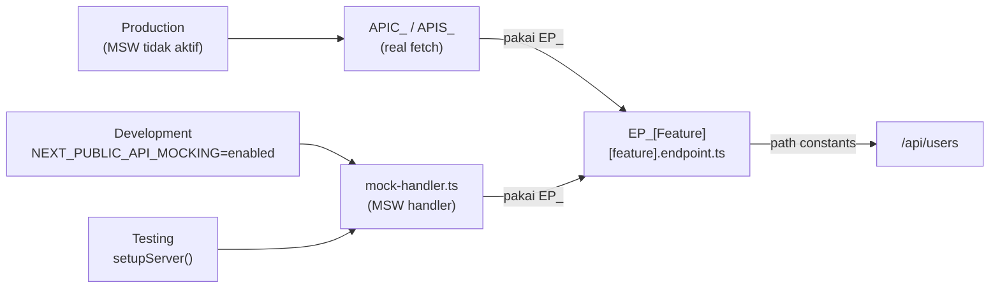

## Tujuan

Pattern I digunakan ketika **API contract sudah disepakati tetapi backend belum siap**, atau ketika ingin **mengisolasi frontend dari backend** saat testing. MSW mengintercepti request di network layer — sama persis dengan request nyata — sehingga tidak ada perubahan pada kode produksi.

Kunci dari pattern ini adalah **`EP_` (Endpoint Registry)**: konstanta path API yang dipakai bersama oleh fungsi fetch (`APIS_`/`APIC_`) dan mock handler. Ini memastikan tidak ada duplikasi path yang bisa menyebabkan ketidaksesuaian saat path berubah.

---

## Alur Data



**Urutan setup:**

| Langkah | File | Tugas |
|---------|------|-------|
| 1 | `api/[feature]/[feature].endpoint.ts` | Definisikan `EP_` — semua path API feature ini |
| 2 | `api/[feature]/[resource].ts` | Gunakan `EP_` di fungsi fetch (`APIS_`/`APIC_`) |
| 3 | `api/[feature]/[resource].mock-handler.ts` | Tulis handler MSW — gunakan `EP_` yang sama |
| 4 | `src/mocks/index.ts` | Daftarkan handler baru |
| 5 | `app/layout.tsx` | Aktifkan via env flag (dev) atau test setup (testing) |

---

## Aturan

1. **`EP_` adalah satu-satunya source of truth path API** — tidak ada string path di fungsi fetch maupun handler.
2. **Handler co-located dengan API file** — `[resource].mock-handler.ts` ada di folder `api/[feature]/` yang sama dengan `[resource].ts`.
3. **Response mock harus sesuai `IRs_`** — bentuk data harus identik dengan interface response yang sudah didefinisikan.
4. **`src/mocks/` hanya berisi wiring** — import dan setup, bukan definisi handler.
5. **Tidak pernah aktif di production** — selalu guard dengan `process.env.NEXT_PUBLIC_API_MOCKING`.
6. **Reset handler di testing** — `server.resetHandlers()` di `afterEach` agar tidak bocor antar test.
7. **Hapus mock saat backend siap** — pattern ini bersifat sementara; bersihkan file `mock-handler` dan import di `src/mocks/index.ts` setelah integrasi nyata selesai.

---

## Contoh

Fitur `user-management` — mock API list dan create user selama backend belum siap.

### Struktur File

```
api/user-management/
├── user-management.endpoint.ts    EP_UserManagement — path constants
├── users.ts                       APIS_GetUsers, APIS_CreateUser
├── users.type.ts                  IRq_CreateUser, IRs_UserList
├── users-list.mock-handler.ts     mock GET /api/user-management/users
└── users-create.mock-handler.ts   mock POST /api/user-management/users

src/mocks/
├── browser.ts    setupWorker — aktivasi di Next.js client
├── node.ts       setupServer — aktivasi di testing
└── index.ts      kumpulkan semua handler + export initMocks()
```

### `api/user-management/user-management.endpoint.ts`

```ts
export const EP_UserManagement = {
//             ↑ EP_ prefix — endpoint path registry untuk feature ini
    list: "/api/user-management/users",
    detail: (id: string) => `/api/user-management/users/${id}`,
//          ↑ dynamic path via fungsi — tidak ada string interpolation tersebar
    create: "/api/user-management/users",
    delete: (id: string) => `/api/user-management/users/${id}`,
}
```

### `api/user-management/users.ts` (update)

```ts
import { EP_UserManagement } from "./user-management.endpoint"
//         ↑ import path dari EP_ — tidak hardcode string path

import type { IRq_GetUsers, IRs_UserList } from "./users.type"

export async function APIS_GetUsers(params: IRq_GetUsers): Promise<IRs_UserList> {
    const qs = new URLSearchParams({
        search: params.search ?? "",
        page: String(params.page ?? 1),
    })
    const res = await fetch(`${EP_UserManagement.list}?${qs}`)
//                                ↑ EP_ dipakai di sini — sama dengan yang dipakai handler
    return res.json()
}
```

### `api/user-management/users-list.mock-handler.ts`

```ts
import { http, HttpResponse } from "msw"
import { EP_UserManagement } from "./user-management.endpoint"
import type { IRs_UserList } from "./users.type"

export const userListHandler = http.get(EP_UserManagement.list, () => {
//                                          ↑ path dari EP_ — konsisten dengan APIS_GetUsers
    return HttpResponse.json<IRs_UserList>({
//                           ↑ typed dengan IRs_ — response shape harus identik
        items: [
            { id: "1", name: "Andikha", email: "andikha@example.com", role: "admin" },
            { id: "2", name: "Budi", email: "budi@example.com", role: "viewer" },
        ],
        total: 2,
    })
})
```

### `api/user-management/users-create.mock-handler.ts`

```ts
import { http, HttpResponse } from "msw"
import { EP_UserManagement } from "./user-management.endpoint"

export const userCreateHandler = http.post(EP_UserManagement.create, async ({ request }) => {
    const body = await request.json() as { name: string; email: string; role: string }

    return HttpResponse.json({
        ok: true,
        data: { id: crypto.randomUUID(), ...body },
        message: "User berhasil dibuat",
    }, { status: 201 })
})
```

### `src/mocks/index.ts`

```ts
// Daftarkan semua handler dari api/**
// Tambah import baru setiap kali menambah mock-handler

import { userListHandler, userCreateHandler } from "@/api/user-management/users-list.mock-handler"

export const handlers = [
    userListHandler,
    userCreateHandler,
]

export async function initMocks() {
    if (typeof window === "undefined") return
    const { worker } = await import("./browser")
    return worker.start({ onUnhandledRequest: "bypass" })
//                                            ↑ request tanpa handler diteruskan ke server
}
```

### Aktivasi Development — `app/layout.tsx`

```ts
// Aktifkan MSW hanya saat env variable di-set — tidak pernah di production
if (process.env.NEXT_PUBLIC_API_MOCKING === "enabled") {
    const { initMocks } = await import("@/mocks")
    await initMocks()
}
```

### Aktivasi Testing — `vitest.setup.ts`

```ts
import { server } from "@/mocks/node"

beforeAll(() => server.listen())
afterEach(() => server.resetHandlers())
//               ↑ reset setelah setiap test — handler override per test tidak bocor
afterAll(() => server.close())
```

### Override Handler per Test (Error Simulation)

```ts
// app/user-management/$test/user-management.integration.test.ts
import { server } from "@/mocks/node"
import { http, HttpResponse } from "msw"
import { EP_UserManagement } from "@/api/user-management/user-management.endpoint"

test("menampilkan pesan error saat list gagal", async () => {
    server.use(
        http.get(EP_UserManagement.list, () =>
            HttpResponse.json({ message: "Server Error" }, { status: 500 })
        )
    )
    // render dan assert pesan error tampil
})
```

---

## Kapan Tidak Pakai Ini

| Situasi | Yang Lebih Tepat |
|---------|-----------------|
| Backend sudah siap dan bisa diakses | Hapus mock-handler, gunakan API langsung |
| Butuh mock data hanya untuk satu component | Props atau `defaultValues` — tidak perlu MSW |
| Simulasi state loading di Storybook | Storybook decorator, bukan MSW |
| Fake data untuk development database | Seed script di backend, bukan mock |
