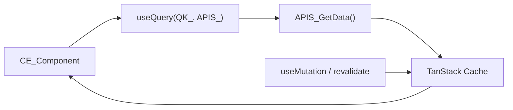

## Tujuan

Pattern B digunakan ketika data tidak cukup hanya di-fetch sekali saat render — misalnya tabel yang harus refresh setelah mutasi, dashboard dengan polling otomatis, atau list yang bergantung pada filter yang diubah user. TanStack Query mengelola cache, loading state, error state, dan refetch secara otomatis. Query key (`QK_`) didefinisikan di `reg/query-keys.register.ts` sebagai satu-satunya sumber kebenaran agar invalidasi dan prefetch konsisten.

---

## Alur Data



**Urutan eksekusi:**

| Langkah | File | Tugas |
|---------|------|-------|
| 1 | `reg/query-keys.register.ts` | Definisikan `QK_` dengan semua variabel dependen |
| 2 | `CE_` component | Panggil `useQuery({ queryKey: QK_(...), queryFn })` |
| 3 | `APIS_` function | HTTP fetch ke backend |
| 4 | TanStack Cache | Simpan hasil, kelola stale/fresh, trigger refetch |

---

## Aturan

1. **`queryKey` selalu menggunakan `QK_` dari registry** — jangan tulis raw array di komponen.
2. **`QK_` harus menyertakan semua variabel yang mempengaruhi hasil query** — jika `search` berubah, queryKey harus berubah sehingga cache terpisah.
3. **`queryFn` harus memanggil fungsi `APIS_`** — bukan fetch inline.
4. **Set `staleTime` sesuai volatilitas data** — data statis bisa pakai `Infinity`, data dinamis 30–60 detik.
5. **Invalidasi setelah mutasi** dengan `queryClient.invalidateQueries({ queryKey: QK_(...) })`.
6. **Gunakan `prefetchQuery` di Server Component** untuk pre-populate cache sebelum halaman dikirim ke client — menghilangkan loading state awal.
7. **Wrap dengan `HydrationBoundary`** jika menggunakan prefetch dari server.
8. **Gunakan `useTransition` atau `isPending`** dari TanStack Query untuk loading state, bukan state manual.

---

## Contoh

Fitur `user-list` — tabel user yang refresh otomatis setelah delete.

### Struktur File

```
app/user-list/
├── $element/
│   └── client.userlist.tsx    CE_UserList
├── $action/
│   └── action.delete.ts       ACT_DeleteUser
└── page.tsx

reg/
└── query-keys.register.ts     QK_UserList

api/user/
├── list.ts                    APIS_GetUsers
└── list.type.ts               IRq_GetUsers, IRs_GetUsers
```

### `reg/query-keys.register.ts`

```ts
// Query key factory — semua variabel dependen masuk ke key
export const QK_UserList = (search: string, page: number) =>
    ["user", "list", { search, page }] as const

// Untuk invalidasi semua varian user list:
export const QK_UserListBase = () => ["user", "list"] as const
```

### `api/user/list.ts`

```ts
import type { IRq_GetUsers, IRs_GetUsers } from "./list.type"

export async function APIS_GetUsers(params: IRq_GetUsers): Promise<IRs_GetUsers> {
    const qs = new URLSearchParams({
        search: params.search ?? "",
        page: String(params.page ?? 1),
    })
    const res = await fetch(`/api/users?${qs}`)
    if (!res.ok) throw new Error("Failed to fetch users")
    return res.json()
}
```

### `$element/client.userlist.tsx`

```tsx
"use client"

import { useQuery, useQueryClient } from "@tanstack/react-query"
import { QK_UserList, QK_UserListBase } from "@/reg/query-keys.register"
import { APIS_GetUsers } from "@/api/user/list"
import { ACT_DeleteUser } from "../$action/action.delete"

interface I_Props {
    search: string
    page: number
}

export function CE_UserList({ search, page }: I_Props) {
    const queryClient = useQueryClient()

    const { data, isLoading, isError } = useQuery({
        queryKey: QK_UserList(search, page),
        queryFn: () => APIS_GetUsers({ search, page }),
        staleTime: 30_000, // 30 detik
    })

    async function handleDelete(userId: string) {
        await ACT_DeleteUser(userId)
        // Invalidasi semua varian list setelah delete
        queryClient.invalidateQueries({ queryKey: QK_UserListBase() })
    }

    if (isLoading) return <UserListSkeleton />
    if (isError) return <p>Gagal memuat data. Coba lagi.</p>

    return (
        <div>
            <p>{data?.total ?? 0} user ditemukan</p>
            <ul>
                {data?.items.map((user) => (
                    <li key={user.id} className="flex justify-between items-center py-2">
                        <span>{user.name} — {user.email}</span>
                        <button
                            onClick={() => handleDelete(user.id)}
                            className="text-destructive text-sm"
                        >
                            Hapus
                        </button>
                    </li>
                ))}
            </ul>
        </div>
    )
}

function UserListSkeleton() {
    return (
        <div className="space-y-2 animate-pulse">
            {Array.from({ length: 5 }).map((_, i) => (
                <div key={i} className="h-10 bg-muted rounded" />
            ))}
        </div>
    )
}
```

### Prefetch di Server Component (opsional, untuk UX lebih baik)

```tsx
// $element/server.layout.tsx
import { dehydrate, HydrationBoundary, QueryClient } from "@tanstack/react-query"
import { QK_UserList } from "@/reg/query-keys.register"
import { APIS_GetUsers } from "@/api/user/list"
import { CE_UserList } from "./client.userlist"

export async function SE_UserListLayout({
    search = "",
    page = 1,
}: {
    search?: string
    page?: number
}) {
    const queryClient = new QueryClient()

    await queryClient.prefetchQuery({
        queryKey: QK_UserList(search, page),
        queryFn: () => APIS_GetUsers({ search, page }),
        staleTime: 30_000,
    })

    return (
        <HydrationBoundary state={dehydrate(queryClient)}>
            <CE_UserList search={search} page={page} />
        </HydrationBoundary>
    )
}
```

### `lib/query-client.ts` — Konfigurasi default

```ts
import { QueryClient } from "@tanstack/react-query"

export function makeQueryClient() {
    return new QueryClient({
        defaultOptions: {
            queries: {
                staleTime: 60_000,   // 1 menit default
                gcTime: 300_000,     // 5 menit di cache setelah tidak dipakai
                retry: 1,
            },
        },
    })
}
```

---

## Kapan Tidak Pakai Ini

| Situasi | Pattern yang Tepat |
|---------|-------------------|
| Data hanya dibutuhkan saat render awal, tidak berubah tanpa navigasi | [Pattern A — Server Fetch](/patterns/server-fetch) |
| Data yang sama dipakai Pattern A dan Pattern B | Pilih salah satu — jangan duplikat |
| Submit form (create/update/delete) | [Pattern C — Form Submit](/patterns/form-submit) |
| State filter/search yang perlu di-bookmark | [Pattern D — URL Search Params](/patterns/url-params) |
