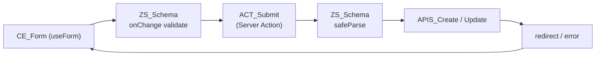

## Tujuan

Pattern C menangani semua form submission: login, registrasi, edit data, delete konfirmasi. Validasi dilakukan dua kali — di client untuk real-time feedback (UX), dan di Server Action untuk keamanan (server tidak pernah percaya input client). Zod schema (`ZS_`) didefinisikan satu kali dan dipakai oleh keduanya. TanStack Form mengelola state field, error display, dan loading state secara reaktif tanpa boilerplate manual.

---

## Alur Data



**Urutan eksekusi:**

| Langkah | File | Tugas |
|---------|------|-------|
| 1 | `[feature].schema.ts` | Definisikan `ZS_` schema — sumber kebenaran validasi |
| 2 | `client.form.tsx` | `useForm` dengan `validatorAdapter: zodValidator()` |
| 3 | User input | TanStack Form validasi `onChange` / `onBlur` secara real-time |
| 4 | Submit | `onSubmit` memanggil `ACT_Submit(value)` |
| 5 | `action.submit.ts` | `safeParse` ulang dengan Zod, panggil `APIS_`, redirect |

---

## Aturan

1. **`ZS_` schema di `[feature].schema.ts`** — satu file, diimport oleh form dan Server Action.
2. **Validasi client (`onChange`/`onBlur`) menggunakan `zodValidator()`** dari `@tanstack/zod-form-adapter`.
3. **Server Action wajib `safeParse` ulang** — client validation bisa dibypass, server tidak boleh menganggap data sudah valid.
4. **Server Action mengembalikan typed error object** — bukan throw exception — agar form bisa menampilkan error spesifik per field.
5. **`ACT_` memanggil `revalidatePath` atau `revalidateTag`** setelah mutasi berhasil, sebelum redirect.
6. **Selalu `e.preventDefault()` dan `e.stopPropagation()`** di handler submit form.
7. **Gunakan `form.Subscribe`** untuk disable tombol saat `isSubmitting` — bukan state manual.
8. **Tampilkan error hanya setelah `isTouched`** — tidak langsung saat field pertama kali muncul.
9. **`ACT_` ada di `$action/action.[sub].ts`** dengan directive `"use server"` di baris pertama.

---

## Contoh

Fitur `login` — form email + password dengan validasi lengkap.

### Struktur File

```
app/login/
├── $action/
│   └── action.submit.ts       ACT_SubmitLogin
├── $element/
│   └── client.form.tsx        CE_LoginForm
├── login.schema.ts            ZS_LoginForm
└── page.tsx

api/auth/
├── login.ts                   APIS_Login
└── login.type.ts              IRq_Login, IRs_Login
```

### `login.schema.ts`

```ts
import { z } from "zod"

export const ZS_LoginForm = z.object({
    email: z.string().email("Format email tidak valid"),
    password: z.string().min(8, "Password minimal 8 karakter"),
})

// Inferring tipe dari schema — satu sumber kebenaran
export type T_LoginForm = z.infer<typeof ZS_LoginForm>
```

### `api/auth/login.type.ts`

```ts
export interface IRq_Login {
    email: string
    password: string
}

export interface IRs_Login {
    token: string
    user: {
        id: string
        name: string
        email: string
    }
}
```

### `api/auth/login.ts`

```ts
import type { IRq_Login, IRs_Login } from "./login.type"

export async function APIS_Login(data: IRq_Login): Promise<{ ok: boolean; data?: IRs_Login; message: string }> {
    const res = await fetch(`${process.env.API_URL}/auth/login`, {
        method: "POST",
        headers: { "Content-Type": "application/json" },
        body: JSON.stringify(data),
    })

    if (!res.ok) {
        const err = await res.json()
        return { ok: false, message: err.message ?? "Login gagal" }
    }

    const result = await res.json()
    return { ok: true, data: result, message: "OK" }
}
```

### `$action/action.submit.ts`

```ts
"use server"

import { redirect } from "next/navigation"
import { revalidatePath } from "next/cache"
import { ZS_LoginForm } from "../login.schema"
import { APIS_Login } from "@/api/auth/login"
import { SFN_SaveSession } from "@/lib/session"
import type { IRq_Login } from "@/api/auth/login.type"

type T_ActionResult = {
    error?: {
        email?: string[]
        password?: string[]
        _root?: string[]
    }
}

export async function ACT_SubmitLogin(data: IRq_Login): Promise<T_ActionResult | void> {
    // Validasi ulang di server — wajib, tidak percaya client
    const parsed = ZS_LoginForm.safeParse(data)
    if (!parsed.success) {
        return { error: parsed.error.flatten().fieldErrors }
    }

    const result = await APIS_Login(parsed.data)
    if (!result.ok || !result.data) {
        return { error: { _root: [result.message] } }
    }

    await SFN_SaveSession(result.data.token)
    revalidatePath("/dashboard")
    redirect("/dashboard")
}
```

### `$element/client.form.tsx`

```tsx
"use client"

import { useState } from "react"
import { useForm } from "@tanstack/react-form"
import { zodValidator } from "@tanstack/zod-form-adapter"
import { ACT_SubmitLogin } from "../$action/action.submit"
import { ZS_LoginForm } from "../login.schema"

export function CE_LoginForm() {
    const [rootError, setRootError] = useState<string | null>(null)

    const form = useForm({
        defaultValues: { email: "", password: "" },
        validatorAdapter: zodValidator(),
        validators: {
            onSubmit: ZS_LoginForm,
        },
        onSubmit: async ({ value }) => {
            setRootError(null)
            const result = await ACT_SubmitLogin(value)
            if (result?.error?._root) {
                setRootError(result.error._root[0])
            }
        },
    })

    return (
        <form
            onSubmit={(e) => {
                e.preventDefault()
                e.stopPropagation()
                form.handleSubmit()
            }}
            className="space-y-4"
        >
            {/* Error level form */}
            {rootError && (
                <div className="rounded border border-destructive p-3 text-destructive text-sm">
                    {rootError}
                </div>
            )}

            {/* Field: email */}
            <form.Field
                name="email"
                validators={{
                    onChange: ZS_LoginForm.shape.email,
                    onBlur: ZS_LoginForm.shape.email,
                }}
            >
                {(field) => (
                    <div className="space-y-1">
                        <label htmlFor={field.name} className="text-sm font-medium">
                            Email
                        </label>
                        <input
                            id={field.name}
                            type="email"
                            value={field.state.value}
                            onChange={(e) => field.handleChange(e.target.value)}
                            onBlur={field.handleBlur}
                            className="w-full border rounded px-3 py-2"
                            placeholder="nama@contoh.com"
                        />
                        {field.state.meta.isTouched && field.state.meta.errors[0] && (
                            <p className="text-destructive text-xs">
                                {field.state.meta.errors[0].toString()}
                            </p>
                        )}
                    </div>
                )}
            </form.Field>

            {/* Field: password */}
            <form.Field
                name="password"
                validators={{
                    onChange: ZS_LoginForm.shape.password,
                    onBlur: ZS_LoginForm.shape.password,
                }}
            >
                {(field) => (
                    <div className="space-y-1">
                        <label htmlFor={field.name} className="text-sm font-medium">
                            Password
                        </label>
                        <input
                            id={field.name}
                            type="password"
                            value={field.state.value}
                            onChange={(e) => field.handleChange(e.target.value)}
                            onBlur={field.handleBlur}
                            className="w-full border rounded px-3 py-2"
                        />
                        {field.state.meta.isTouched && field.state.meta.errors[0] && (
                            <p className="text-destructive text-xs">
                                {field.state.meta.errors[0].toString()}
                            </p>
                        )}
                    </div>
                )}
            </form.Field>

            {/* Submit button */}
            <form.Subscribe
                selector={(s) => [s.canSubmit, s.isSubmitting]}
            >
                {([canSubmit, isSubmitting]) => (
                    <button
                        type="submit"
                        disabled={!canSubmit || isSubmitting}
                        className="w-full bg-primary text-primary-foreground rounded px-4 py-2 disabled:opacity-50"
                    >
                        {isSubmitting ? "Memproses..." : "Masuk"}
                    </button>
                )}
            </form.Subscribe>
        </form>
    )
}
```

### `page.tsx`

```tsx
import { SE_LoginLayout } from "./$element/server.layout"

export default function Page() {
    return <SE_LoginLayout />
}
```

---

## Kapan Tidak Pakai Ini

| Situasi | Pattern yang Tepat |
|---------|-------------------|
| Hanya membaca data (tidak ada mutasi) | [Pattern A](/patterns/server-fetch) atau [Pattern B](/patterns/client-fetch) |
| Filter/search yang perlu di-bookmark | [Pattern D — URL Search Params](/patterns/url-params) |
| Delete tanpa konfirmasi form | `useMutation` dari TanStack Query langsung |
| File upload dengan progress tracking | Custom dengan `FormData` + progress event |
