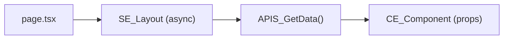

## Tujuan

Pattern A digunakan ketika data perlu tersedia sejak halaman pertama kali di-render — tanpa menunggu interaksi user. Karena fetch terjadi di Server Component (`SE_`), data langsung tersedia di HTML yang dikirim ke browser: lebih cepat (tidak ada loading flicker), lebih baik untuk SEO, dan tidak membocorkan API key ke client. Gunakan pattern ini untuk halaman listing, halaman detail, dan konten yang jarang berubah atau berubah hanya saat navigasi.

---

## Alur Data



**Urutan eksekusi:**

| Langkah | File | Tugas |
|---------|------|-------|
| 1 | `page.tsx` | Terima `searchParams`, render `SE_` |
| 2 | `SE_` component | `async`, panggil `await APIS_GetData()` |
| 3 | `APIS_` function | HTTP fetch ke backend/database |
| 4 | `CE_` component | Terima data via props, handle interaktivitas |

---

## Aturan

1. **`page.tsx` hanya boleh return satu komponen** — tidak ada logika, kondisional, atau fetch di sini.
2. **`SE_` harus `async`** — karena memanggil `await APIS_GetData()`.
3. **Data diteruskan ke `CE_` via props** — bukan melalui Context atau store global.
4. **Gunakan `loading.tsx`** di folder feature untuk menampilkan skeleton saat Server Component sedang di-render (Suspense boundary otomatis dari Next.js).
5. **Gunakan `error.tsx`** di folder feature untuk menangani error fetch tanpa merusak halaman lain.
6. **`APIS_` function harus ada di `api/[feature]/`** — bukan inline di komponen.
7. **Jangan gunakan pattern ini** jika data perlu di-refresh tanpa navigasi — gunakan [Pattern B](/patterns/client-fetch) (TanStack Query).

---

## Contoh

Fitur `user-list` — menampilkan daftar user dengan search dari URL.

### Struktur File

```
app/user-list/
├── $element/
│   ├── server.layout.tsx      SE_UserListLayout
│   └── client.table.tsx       CE_UserTable
├── loading.tsx
├── error.tsx
└── page.tsx

api/user/
├── list.ts                    APIS_GetUsers
└── list.type.ts               IRq_GetUsers, IRs_GetUsers
```

### `page.tsx`

```tsx
import { SE_UserListLayout } from "./$element/server.layout"

export default async function Page({
    searchParams,
}: {
    searchParams: Promise<{ search?: string; page?: string }>
}) {
    const params = await searchParams
    return <SE_UserListLayout searchParams={params} />
}
```

### `api/user/list.type.ts`

```ts
export interface IRq_GetUsers {
    search?: string
    page?: number
}

export interface IRs_GetUsers {
    items: I_User[]
    total: number
    page: number
}

export interface I_User {
    id: string
    name: string
    email: string
    role: string
}
```

### `api/user/list.ts`

```ts
import type { IRq_GetUsers, IRs_GetUsers } from "./list.type"

export async function APIS_GetUsers(params: IRq_GetUsers): Promise<IRs_GetUsers> {
    const qs = new URLSearchParams()
    if (params.search) qs.set("search", params.search)
    if (params.page) qs.set("page", String(params.page))

    const res = await fetch(`${process.env.API_URL}/users?${qs}`, {
        next: { tags: ["users"] },
    })

    if (!res.ok) throw new Error("Failed to fetch users")
    return res.json()
}
```

### `$element/server.layout.tsx`

```tsx
import { APIS_GetUsers } from "@/api/user/list"
import { CE_UserTable } from "./client.table"

interface I_Props {
    searchParams: { search?: string; page?: string }
}

export async function SE_UserListLayout({ searchParams }: I_Props) {
    const data = await APIS_GetUsers({
        search: searchParams.search,
        page: Number(searchParams.page) || 1,
    })

    return (
        <section>
            <h1>Daftar User</h1>
            <CE_UserTable items={data.items} total={data.total} />
        </section>
    )
}
```

### `$element/client.table.tsx`

```tsx
"use client"

import type { I_User } from "@/api/user/list.type"

interface I_Props {
    items: I_User[]
    total: number
}

export function CE_UserTable({ items, total }: I_Props) {
    return (
        <div>
            <p>{total} user ditemukan</p>
            <table>
                <thead>
                    <tr>
                        <th>Nama</th>
                        <th>Email</th>
                        <th>Role</th>
                    </tr>
                </thead>
                <tbody>
                    {items.map((user) => (
                        <tr key={user.id}>
                            <td>{user.name}</td>
                            <td>{user.email}</td>
                            <td>{user.role}</td>
                        </tr>
                    ))}
                </tbody>
            </table>
        </div>
    )
}
```

### `loading.tsx`

```tsx
export default function Loading() {
    return (
        <section>
            <h1>Daftar User</h1>
            <div className="animate-pulse space-y-2">
                {Array.from({ length: 5 }).map((_, i) => (
                    <div key={i} className="h-10 bg-muted rounded" />
                ))}
            </div>
        </section>
    )
}
```

---

## Kapan Tidak Pakai Ini

| Situasi | Pattern yang Tepat |
|---------|-------------------|
| Data perlu auto-refresh / polling | [Pattern B — Client Fetch](/patterns/client-fetch) |
| Data bergantung pada interaksi user (filter, sort) | [Pattern B](/patterns/client-fetch) + [Pattern D](/patterns/url-params) |
| Form submission (create/update/delete) | [Pattern C — Form Submit](/patterns/form-submit) |
| State modal, toggle, selected row | [Pattern E — Zustand](/patterns/zustand) |
